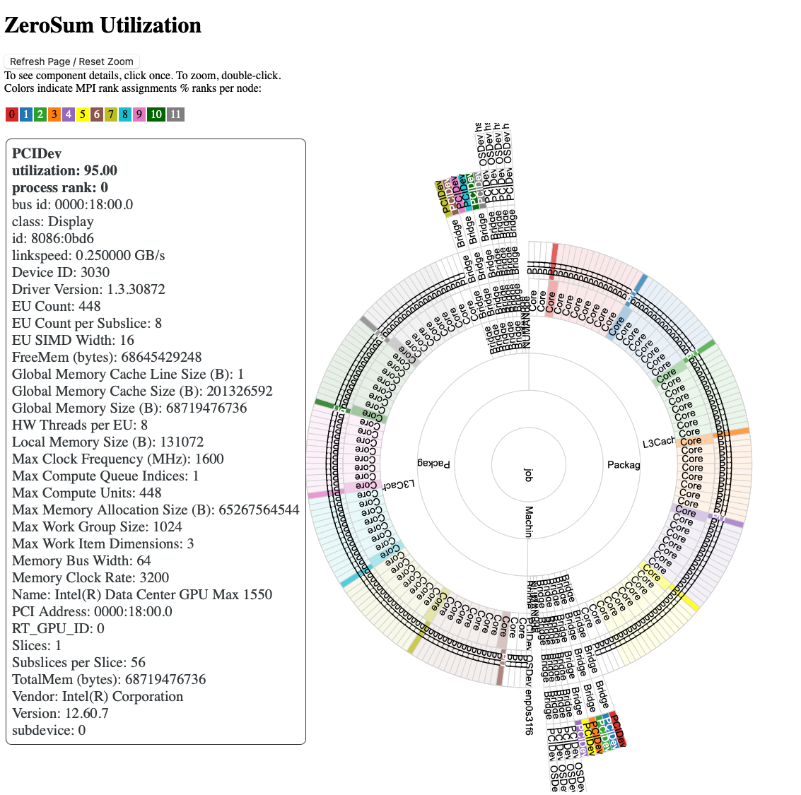
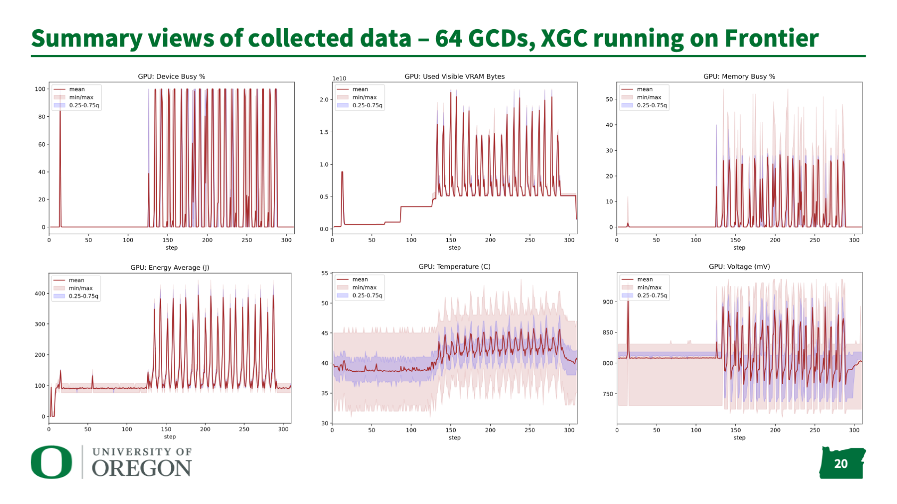
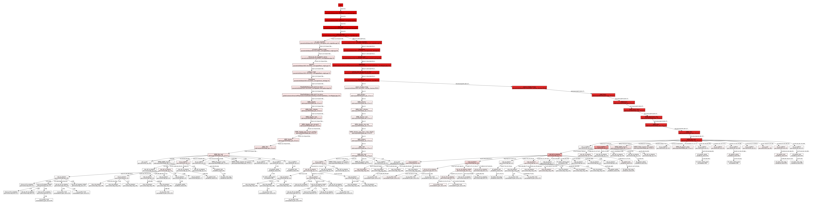

# zerosum
Utility for monitoring process, thread, OS and HW resources, including GPU utilization.


<i>Example sunburst plot from a one node run on Sunspot (ALCF).</i>

<i>Summary views of collected data – 64 GCDs, XGC running on Frontier (OLCF).</i>

<i>STAT-like view of divergent callpaths in hung MPI application with 512 MPI ranks (NERSC).</i>

Current CI status on develop branch : [](https://circleci.com/gh/UO-OACISS/zerosum)

Inspired by [Tom Pappatheodore's Hello jsrun code for testing layout of Summit resources](https://code.ornl.gov/t4p/Hello_jsrun), and further inspired by Dagstuhl seminar 23171: ["Driving HPC Operations With Holistic Monitoring and Operational Data Analytics"](https://www.dagstuhl.de/en/seminars/seminar-calendar/seminar-details/23171)

[HUST 2023 Publication](https://dl.acm.org/doi/abs/10.1145/3624062.3624145) - 11th International Workshop on HPC User Support Tools @SC23, 2023

[HUST 2023 Presentation](http://www.nic.uoregon.edu/~khuck/zerosum/2023-HUST-ZeroSum.pdf) - 11th International Workshop on HPC User Support Tools @SC23, 2023

## Overview

ZeroSum will monitor OS threads, OpenMP threads, MPI processes, and the hardware assigned
to them including CPUs, memory usage and GPU utilization. Supported systems include all
Linux operating systems, as well as NVIDIA (CUDA/NVML), AMD (HIP/ROCm-SMI) and Intel (Intel SYCL) GPUs.
Host side monitoring happens through the virtual `/proc` filesystem, so should be portable
to all Linux systems. When integrated with HWLOC, visualizations of utilization data can
be generated from included Python post-processing scripts.

## Build instructions

Configure and build with cmake. See the examples in the various build-\*.sh scripts.
Some systems have their own scripts (like [build-frontier.sh](scripts/build-frontier.sh)).

For a basic installation with CPU-only support, you would do (for example):

```
cmake -B ${builddir} \
-DCMAKE_CXX_COMPILER=`which g++` \
-DCMAKE_C_COMPILER=`which gcc` \
-DCMAKE_BUILD_TYPE=Release \
-DCMAKE_INSTALL_PREFIX=${instdir}
cmake --build ${builddir}
```

For additional support options, add:
* NVIDIA CUDA (NVML): `-DZeroSum_WITH_CUDA=TRUE` and possibly `-DCUDAToolkit_ROOT=<path to cuda>`
* AMD HIP (ROCm-SMI): `-DZeroSum_WITH_HIP=TRUE` and possibly `-DROCM_PATH=/opt/rocm-${ROCM_COMPILER_VERSION}`
* Intel SYCL: `-DZeroSum_WITH_SYCL=TRUE`
* MPI: `-DZeroSum_WITH_MPI=TRUE`.
* OpenMP: `-DZeroSum_WITH_OPENMP=TRUE` and with compilers that support it (NVIDIA, AMD, Clang, Intel) `-DZeroSum_WITH_OMPT=TRUE`.
* HWLOC: set `export PKG_CONFIG_PATH=<path to hwloc>/lib/pkgconfig` and use `-DZeroSum_WITH_HWLOC=TRUE`.

## Other Build Dependencies

Support for specific GPU monitoring libaries is assumed to be installed on the machine already. ZeroSum
does use the PerfStubs git submodule to allow collected data to be passsed on to other
performance tools like [TAU](https://github.com/UO-OACISS/tau2/) or
[APEX](https://github.com/UO-OACISS/apex/). For that reason, a working internet connection
is needed at configuration time. PerfStubs can be disabled with the `-DZeroSum_WITH_PerfStubs=FALSE`
CMake flag at configuration time (FALSE by default). GPU, HWLOC, MPI, and OpenMP support are also optional but recommended.
Post-processing scripts require Pandas.

## Sample Output

Sample output from the first MPI rank of an 8 process job on Frontier (see
cores example from [job-frontier.sh](scripts/job-frontier.sh)):
```
...
Duration of execution: 12.4312 s

Process Summary:
MPI 000 - PID 23319 - Node frontier00255 - CPUs allowed: [1,2,3,4,5,6,7,65,66,67,68,69,70,71]

LWP (thread) Summary:
LWP 23319: Main,OpenMP - stime:   2.38, utime:  90.69, nv_ctx:     1, ctx:  1537, CPUs allowed: [1,65]
LWP 23324:     ZeroSum - stime:   0.27, utime:   0.18, nv_ctx:     0, ctx:    25, CPUs allowed: [71]
LWP 23332:      OpenMP - stime:   0.33, utime:  98.92, nv_ctx:     0, ctx:     5, CPUs allowed: [1,65]
LWP 23341:      OpenMP - stime:   0.33, utime:  98.92, nv_ctx:     0, ctx:     5, CPUs allowed: [2,66]
LWP 23349:      OpenMP - stime:   0.33, utime:  98.92, nv_ctx:     1, ctx:     4, CPUs allowed: [2,66]
LWP 23355:      OpenMP - stime:   0.33, utime:  98.92, nv_ctx:     0, ctx:     4, CPUs allowed: [3,67]
LWP 23362:      OpenMP - stime:   0.33, utime:  98.92, nv_ctx:     1, ctx:     3, CPUs allowed: [3,67]
LWP 23369:      OpenMP - stime:   0.33, utime:  98.08, nv_ctx: 11773, ctx:     2, CPUs allowed: [4,68]
LWP 23377:      OpenMP - stime:   0.33, utime:  98.08, nv_ctx: 11773, ctx:     3, CPUs allowed: [4,68]
LWP 23385:      OpenMP - stime:   0.33, utime:  98.92, nv_ctx:     1, ctx:     3, CPUs allowed: [5,69]
LWP 23393:      OpenMP - stime:   0.33, utime:  98.92, nv_ctx:     1, ctx:     3, CPUs allowed: [5,69]
LWP 23400:      OpenMP - stime:   0.25, utime:  99.00, nv_ctx:     1, ctx:     3, CPUs allowed: [6,70]
LWP 23408:      OpenMP - stime:   0.25, utime:  99.00, nv_ctx:     0, ctx:     3, CPUs allowed: [6,70]
LWP 23416:      OpenMP - stime:   0.25, utime:  98.42, nv_ctx:    26, ctx:     3, CPUs allowed: [7,71]
LWP 23423:      OpenMP - stime:   0.25, utime:  99.00, nv_ctx:     1, ctx:     3, CPUs allowed: [7,71]
LWP 23453:       Other - stime:   0.00, utime:   0.00, nv_ctx:     0, ctx:     3, CPUs allowed: [1,2,3,4,5,6,7,9,10,11,12,13,14,15,17,18,19,20,21,22,23,25,26,27,28,29,30,31,33,34,35,36,37,38,39,41,42,43,44,45,46,47,49,50,51,52,53,54,55,57,58,59,60,61,62,63,65,66,67,68,69,70,71,73,74,75,76,77,78,79,81,82,83,84,85,86,87,89,90,91,92,93,94,95,97,98,99,100,101,102,103,105,106,107,108,109,110,111,113,114,115,116,117,118,119,121,122,123,124,125,126,127]

Hardware Summary:
CPU 001 - idle:   0.00, system:   0.18, user:  99.64
CPU 002 - idle:   0.00, system:   0.09, user:  99.64
CPU 003 - idle:   0.00, system:   0.09, user:  99.64
CPU 004 - idle:   0.00, system:   0.09, user:  99.64
CPU 005 - idle:   0.00, system:   0.09, user:  99.64
CPU 006 - idle:   0.00, system:   0.09, user:  99.64
CPU 007 - idle:   0.00, system:   0.09, user:  99.64
CPU 065 - idle:   0.00, system:   0.00, user:  99.73
CPU 066 - idle:   0.00, system:   0.09, user:  99.64
CPU 067 - idle:   0.00, system:   0.09, user:  99.64
CPU 068 - idle:   0.00, system:   0.09, user:  99.64
CPU 069 - idle:   0.00, system:   0.09, user:  99.64
CPU 070 - idle:   0.00, system:   0.09, user:  99.64
CPU 071 - idle:   0.00, system:   0.36, user:  99.45

GPU 0 - (metric: min  avg  max)
    Clock Frequency, GLX (MHz): 800.000000 800.000000 800.000000
    Clock Frequency, SOC (MHz): 1090.000000 1090.000000 1090.000000
    Device Busy %: 0.000000 0.000000 0.000000
    Energy Average (J): 0.000000 5.900000 6.000000
    GFX Activity: 0.000000 0.000000 0.000000
    GFX Activity %: 0.000000 0.000000 0.000000
    Memory Activity %: 0.000000 0.000000 0.000000
    Memory Busy %: 0.000000 0.000000 0.000000
    Memory Controller Activity: 0.000000 0.000000 0.000000
    Power Average (W): 84.000000 86.363636 93.000000
    Temperature (C): 34.000000 34.545455 35.000000
    Throttle Status: 0.000000 0.000000 0.000000
    Total GTT Bytes: 539494100992.000000 539494100992.000000 539494100992.000000
    Total VRAM Bytes: 68702699520.000000 68702699520.000000 68702699520.000000
    Total Visible VRAM Bytes: 68702699520.000000 68702699520.000000 68702699520.000000
    UVD|VCN Activity: 0.000000 0.000000 0.000000
    Used GTT Bytes: 11452416.000000 11452416.000000 11452416.000000
    Used VRAM Bytes: 13586432.000000 13586432.000000 13586432.000000
    Used Visible VRAM Bytes: 13586432.000000 13586432.000000 13586432.000000
    Voltage (mV): 818.000000 818.000000 818.000000
```
In this example, the `stime` values are time spent in system calls, the `utime` is time spent in user code, `nv_ctx` is the number of nonvoluntary context switches, `ctx` is the number of context switches, and `CPUs allowed` is the list of hardware threads each thread can run on. In the hardware summary, each thread is monitored to determine utilization. In the GPU summary, utilization data is summarized.

## Notes

 * Don't want to pin progress threads from MPI or GPU runtimes. They are designed
   and expected to "run free".
   Future todo: Might want to identify the origin of the threads (if possible).
   MPI, HIP, CUDA threads should be allowed to float within their
   assigned resource set.
 * ZeroSum spawns a thread to monitor the process, so there is one additional
   thread. That thread is identified with type 'ZeroSum'. It will always report as
   "running", because it is running when all the threads are queried. However,
   it is almost always sleeping. It gets pinned to the last
   core in the resource set, that could be configurable (future todo).
 * ~~Future todo: To get backtrace of each thread:
   https://github.com/albertz/openlierox/blob/0.59/src/common/Debug_GetCallstack.cpp
   This could be useful to determine library source of thread, if needed.~~ done!
 * On SYCL machines, you have to set `ZES_ENABLE_SYSMAN=1` or else device queries
   will fail.
 * Other SYCL note: you can theoretically use SYCL on NVIDIA machines (i.e. Polaris),
   and ZeroSum has been tested to work in such situations. It requres supplying the
   path to the compiler directory that has the sycl support included (i.e. LLVM).
   For more details, see the [sourceme-polaris-sycl.sh](scripts/sourceme-polaris-sycl.sh),
   [build-polaris-sycl.sh](scripts/build-polaris-sycl.sh) and
   [job-polaris-sycl.sh](scripts/job-polaris-sycl.sh) scripts.


